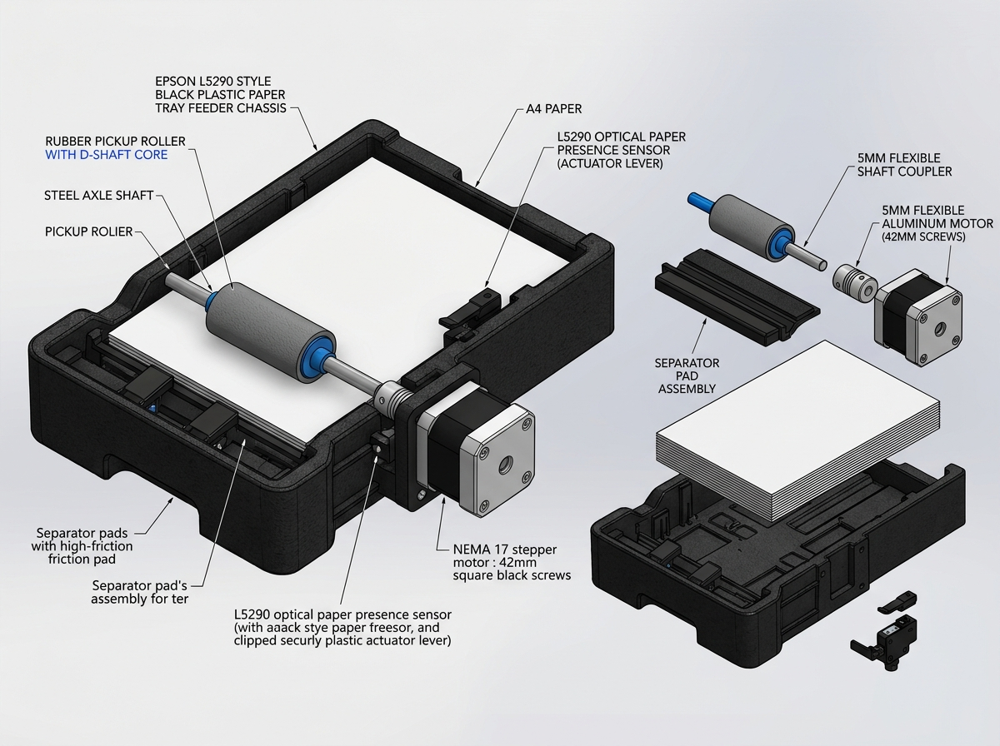
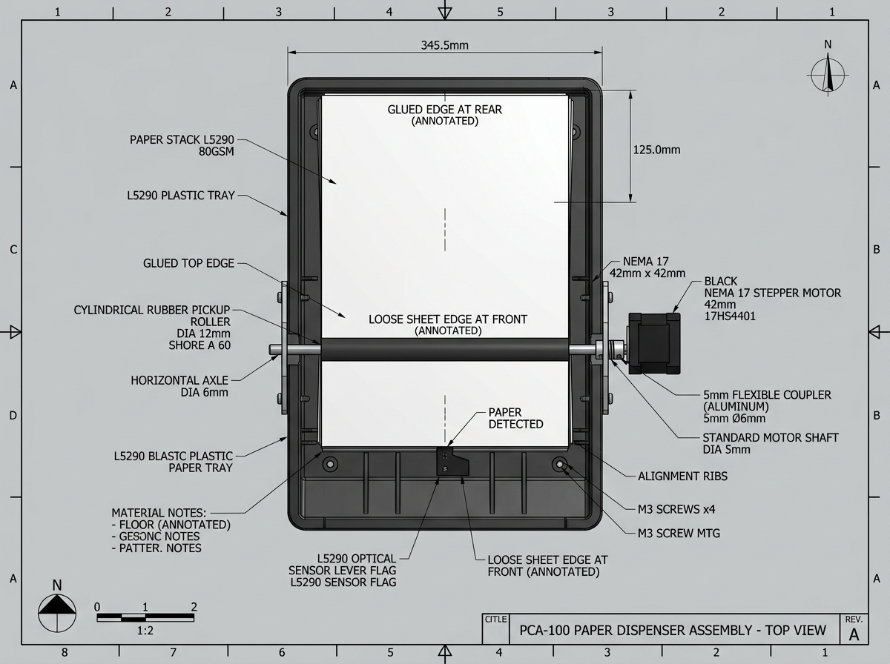
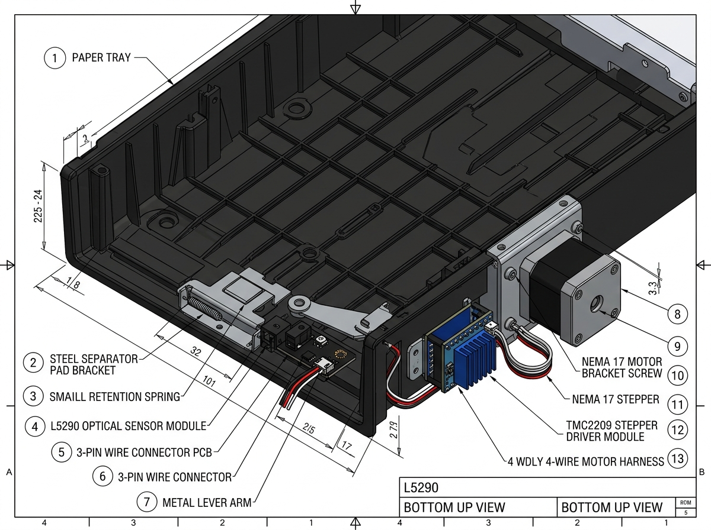
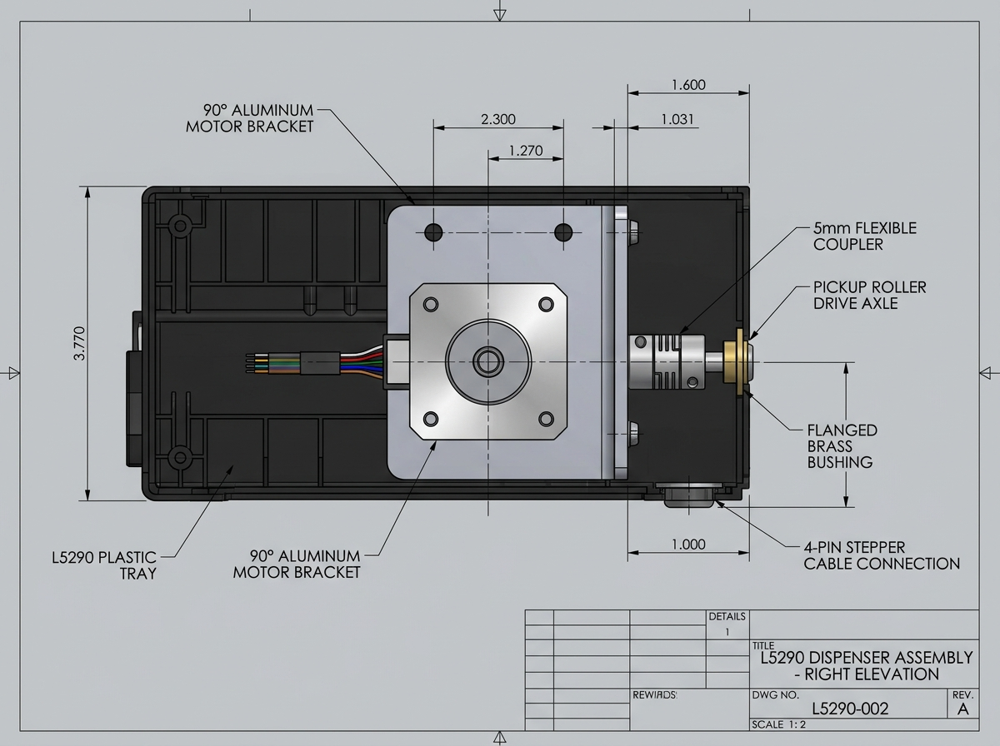

# 📄 Paper Compartment Dispenser Assembly Guide
### Revamped 4-Bay Paper Vendo Machine Capstone
*(Applicable to all 4 identical paper dispenser bays)*

---

## 📸 Generated Visual CAD & Assembly Diagrams

All high-resolution technical rendering diagrams are stored in:
📁 `documentation/paper_compartment_assembly/`

---

### 1. 🔍 Main 3D Perspective & Exploded Assembly View


* **Features shown:**
  * L5290 Paper Tray feeder chassis
  * Rubber pickup roller with D-shaft core on central steel axle
  * Bottom separator pad assembly in front slot
  * NEMA 17 Stepper Motor (42mm) on 90° mounting bracket with 5mm flexible coupler
  * L5290 optical presence sensor clipped with actuator lever flag

---

### 2. ⬇️ Top-Down Plan View (Paper Orientation & Path)


* **Key Alignment Details:**
  * **Glued Top Edge of Paper Pad:** Positioned towards the **rear/top** of the tray.
  * **Loose Bottom Edge:** Positioned towards the **front**, resting directly against the pickup roller.
  * **Optical Sensor Flag:** Centered under the pad to continuously verify stock presence.
  * **Drive Axle:** Transverse shaft driven from the right side.

---

### 3. ⬆️ Bottom / Undercarriage View (Sensor & Driver Electronics)


* **Key Components shown:**
  * **Separator Pad Bracket:** Retained by the small bottom slot spring for upward contact tension.
  * **L5290 Optical Sensor PCB:** Clipped into the designated tray sensor cavity with its 3-pin connector.
  * **NEMA 17 Motor & Bracket:** Fixed to the outer chassis rail.
  * **TMC2209 Stepper Driver Module:** With blue anodized heat sink for quiet, micro-stepped feeding.

---

### 4. ➡️ Right Elevation View (Motor Mount & Drive Train)


* **Key Mechanical Dimensions & Alignment:**
  * Motor shaft aligned on the same horizontal center line as the pickup roller axle.
  * 5mm flexible aluminum coupler absorbs any minor shaft runout.
  * Flanged brass/nylon bushing mounted in the plastic tray side wall for smooth axle rotation.

---

### 5. ⬅️ Left Side Cross-Section & Feed Throat Diagram

```
                 [PAPER PAD LOADED IN TRAY]
                  Glued Top (Rear) ──────► ░░░░░░░░░░░░░░░░░░
                                          ░░░░░░░░░░░░░░░░░░
                                          ░░░░░░░░░░░░░░░░░░
                                            │ (Loose Edge Front)
                                            ▼
                           ┌───────────────────────────┐
                           │ [PICKUP ROLLER (Rubber)]  │ ◄─── Driven by NEMA17
                           └─────────────┬─────────────┘
                                         ▼ [PAPER FEED NIP]
   ═══════════════════════════[ SINGLE SHEET EXIT ]════════════════► TO USER DISPENSE CHUTE
                                         ▲
                           ┌─────────────┴─────────────┐
                           │   [SEPARATOR FRICTION]    │ ◄─── Prevents double-feeding
                           │         [PAD]             │
                           └───────────────────────────┘
                                         ▲
                                 (Spring Tension)
```

---

## 🛠️ Step-by-Step Physical Assembly Instructions

### Step 1: Install the Separator Pad
1. Take the black plastic **Separator Pad housing** with the grey rubber friction pad.
2. Insert the small tension spring into the bottom recess under the front throat of the L5290 tray.
3. Snap the separator pad bracket into place. When pressed down lightly, it should spring back up against the feed path.

### Step 2: Mount the L5290 Presence Sensor & Lever
1. Take the small **L5290 Optical Sensor PCB** and the metal/plastic **actuator lever flag**.
2. Pivot the lever arm onto the tray base so the flag arm interrupts the optical slot when the tray is empty.
3. When a paper pad is placed in the tray, the weight of the pad pushes the lever down, moving the flag **out** of the IR slot (State = `HIGH` / Paper Present).
4. Connect the 3-pin sensor wire (`VCC` → 5V, `GND` → GND, `SIG` → Arduino Uno Sensor Pin).

### Step 3: Install the Pickup Roller & Axle
1. Slide the D-shaped blue core of the **rubber pickup roller** onto the main 5mm/6mm steel axle shaft.
2. Position the roller centrally so it makes direct contact with the separator pad underneath.
3. Insert the axle through the side bushing holes of the L5290 plastic tray.

### Step 4: Mount the NEMA 17 Motor & Coupler
1. Bolt the **NEMA 17 Stepper Motor** to the 90° mounting bracket using four M3 screws.
2. Attach the bracket securely to the right side of the paper tray chassis.
3. Connect the 5mm motor shaft to the pickup roller drive axle using the **5mm flexible aluminum coupler**. Tighten the grub screws firmly onto the shaft D-flats.

### Step 5: Electrical Connections (To Arduino Uno & TMC2209)

| Component | Connects To | Pin on Uno (Bay 1 Example) |
| :--- | :--- | :--- |
| **TMC2209 STEP** | Microcontroller Pulse Pin | **Pin D2** |
| **TMC2209 DIR** | Microcontroller Direction Pin | **Pin D3** |
| **TMC2209 EN** | Shared Driver Enable Pin | **Pin D10** |
| **L5290 Sensor SIG** | Optical Paper Presence Pin | **Pin A0** |
| **VMOT & GND** | 12V / 24V External Power Supply | **12V DC Rail + GND** |
| **VIO & GND** | Logic Power Rail | **5V / GND from Uno** |

*(Bays 2, 3, and 4 connect to their respective STEP/DIR and Sensor pins as defined in `revamped_uno_paper.ino`)*

---

## 📝 Verification & Testing Checklist

- [ ] **Sensor Check:** With no paper, serial reports `LOW` (Bay Empty). Insert paper pad $\rightarrow$ serial reports `HIGH` (Paper Present).
- [ ] **Shaft Alignment:** Manually turning the motor turns the pickup roller smoothly without binding.
- [ ] **Paper Separation:** When NEMA17 steps forward, the pickup roller pulls exactly **1 sheet** from the bottom of the pad while the top glued edge stays anchored.
